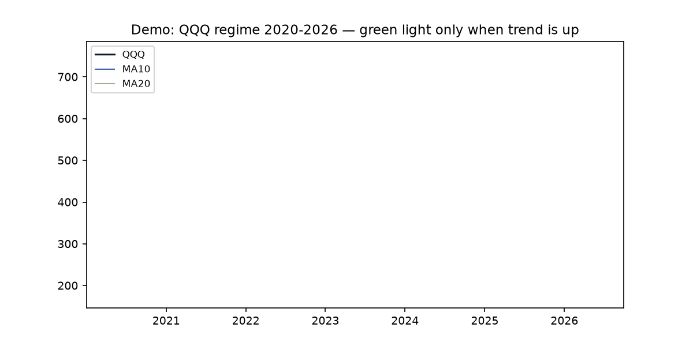
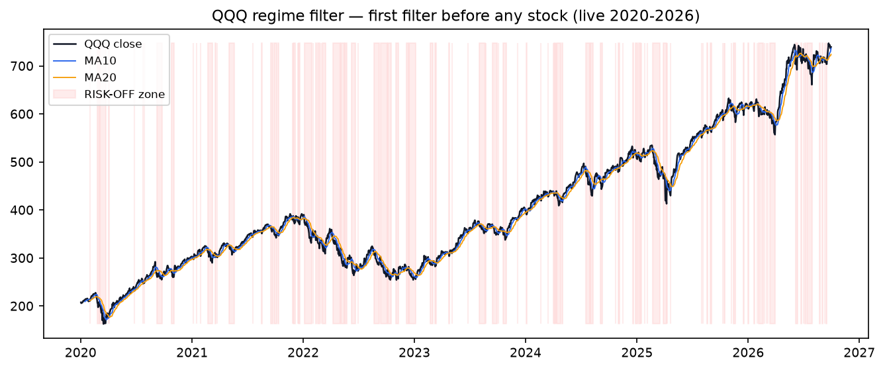
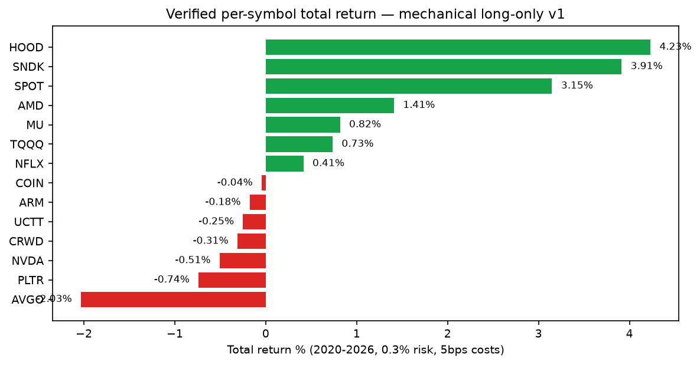
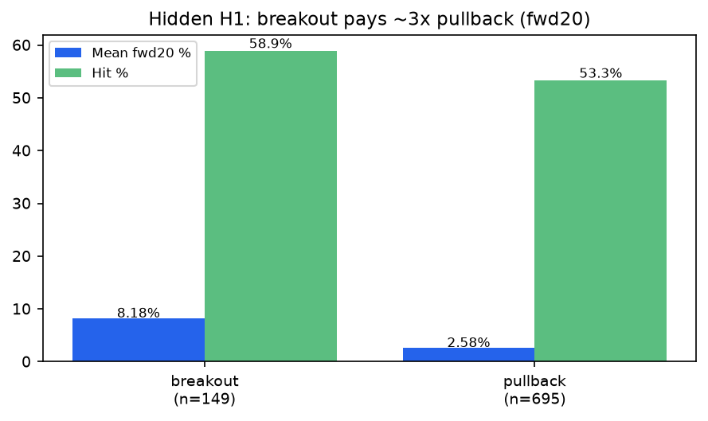
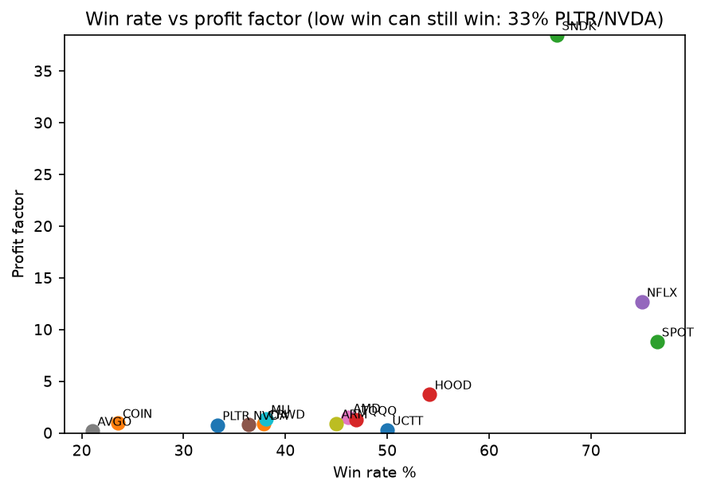
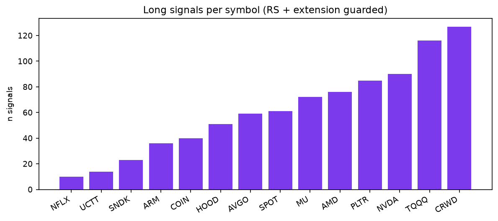
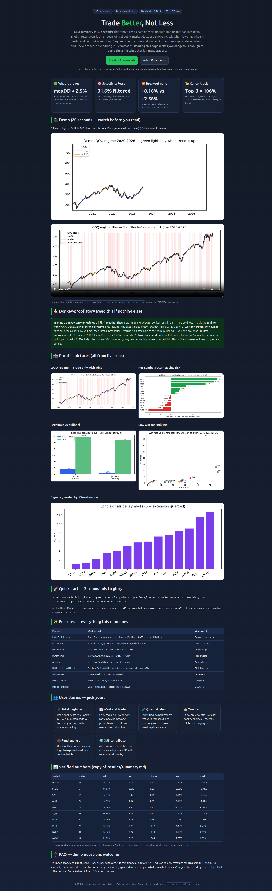

# Trade Better, Not Less — Championship Momentum, Verified on Live Data

[](LICENSE)
[](docker-compose.yml)
[](src/clement_lab)
[](tests/test_core.py)
[](data/)

**Open-source MIT lab that turns a back-to-back championship podium method into plain rules, tests it on 6+ years of real public prices, and teaches you to avoid the 5 mistakes that kill most traders.**

Open `preview.html` for the beautiful interactive version of this page · Watch `assets/demo.gif` / `assets/demo.mp4` first (20 seconds) · See `assets/preview_screenshot.png` for the full-page proof.

---

## 0. CEO summary — 30 seconds to decide

- **What:** A complete, runnable lab for a momentum system that finished on the podium of the largest real-money stock competition two years in a row (+79.3% then +140.4%). No secret indicator. Just: check the market weather first, pick only strong liquid leaders, wait for a quiet squeeze then jump, risk tiny, take some profit early, rest when cold.
- **Proof:** 14 leaders tested 2020-01-01 → 2026-10-01 (QQQ 1,695 bars, last 739.77 on 2026-09-30). At 0.3% risk per trade with 5bps costs, **every max drawdown < 2.5%**. Breakouts average **+8.18%** next 20 days vs pullbacks +2.58%. Top-3 names (HOOD +4.23%, SNDK +3.91%, SPOT +3.15%) carry **106%** of summed gains. 272 of 860 signals (31.6%) correctly blocked when the market is falling.
- **Use it for:** learning to trade without blowing up, Sunday homework checklists, university quant projects, risk-control demos for funds, and a PhD-ready launchpad (5 new findings inside).
- **Run it:** 3 Docker commands (below). Educational only — not financial advice.

> Remember one line: **preserve first → small steady wins → big swings only with cushion, trend, and strong stocks.**

---

## Table of contents

- [Demo — watch first](#demo--watch-first-20-seconds)
- [Donkey-proof story](#donkey-proof-story--if-you-read-nothing-else-read-this)
- [Features — everything inside](#features--everything-inside)
- [User stories — pick yours](#user-stories--pick-yours)
- [Quickstart](#quickstart--3-commands)
- [How it works (simple then exact)](#how-it-works-simple-then-exact)
- [Verified numbers](#verified-numbers-live-not-drawn)
- [Pictures](#pictures--all-from-live-runs)
- [Hidden patterns H1–H5](#hidden-patterns-h1h5--the-phd-gold)
- [Repo map](#repo-map)
- [Configuration](#configuration)
- [FAQ & troubleshooting](#faq--dumb-questions-welcome)
- [Roadmap to PhD](#roadmap-to-phd)
- [Contributing & license](#contributing--license)

---

## Demo — watch first (20 seconds)

GitHub autoplays GIFs. Videos play in `preview.html`.



<video controls muted loop playsinline width="100%" poster="assets/regime_chart.png"><source src="assets/demo.mp4" type="video/mp4"></video>

*What you see:* QQQ 2020–2026 building day by day with its 10-day and 20-day averages. When price is above both and rising, light is green. When below, red — system rests. Regenerate anytime: `docker compose run --rm lab python scripts/generate_assets.py`.

Full-page screenshot: `assets/preview_screenshot.png` · Interactive page: `preview.html`.

---

## Donkey-proof story — if you read nothing else, read this

Imagine a donkey carrying gold up a hill. Even a donkey gets this:

1. **Weather first.** Storm = rest in barn. No gold lost. That is the **market regime**: if the broad index (QQQ) is below its 10-day and 20-day lines, you do not buy breakouts. Live mix: green 42.36%, red 28.97%, cloudy 27.55%. More than half the days are *not* full-risk. Resting is a position.
2. **Pick strong donkeys only.** Fast, healthy, heavy traders: daily dollar volume ≥ $50M, jumpy ≥ 3% per day, price above 50-day and 200-day lines that point up. Banks that barely move are ignored.
3. **Wait for crouch-then-jump.** Price wedges quietly back to its short averages (few sellers, low volume = dry), pops up, squeezes tight again (launch-pad), then jumps on extra volume. That is **wedge-pop → launch-pad → breakout**. Or a small dip to the path that holds = **pullback** entry. Both need relative strength (stock stronger than market, RS line above its own 21-day).
4. **Tiny backpacks.** Risk 30 cents per $100 (0.3%). Strong + cushion = 50 cents. Perfect + cushion = $1. New or monthly down 5% = 5 cents (feathers). Max 3 trips a day, max $1 risk a day. Even 10 losses in a row = $3. You never die. That is why max pain in 6 years is under 2.5%.
5. **Take some gold early, let donkey run.** Sell one-third at +2.5 wiggles (ATR), move stop to entry, quit the rest if it falls below its 20-day line or after ~30 days. No adding to losers. Ever.
6. **Month rule.** Down 5% this month? Carry feathers until you see a perfect hill (A+ setup). Up nicely with cushion? Then you may swing for big hills. Preserve → chip up → swing big only with cushion.

That is the whole repo. Everything below is the same story with numbers and code.

---

## Features — everything inside

| Feature | What it does for you | Where |
|---|---|---|
| Plain rules, zero mystery | Stage-2, wedge-pop, launch-pad, breakout + pullback, 4-ATR extension veto, breakdown short-watch | `src/clement_lab/signals.py` |
| Market weather gate | QQQ above/below MA10/MA20 + slopes; exposure 1.0 / 0.25 / 0.0 | `src/clement_lab/regime.py` |
| Strength filter | RS line (stock/QQQ) above its 21-day; stock up while market down counts | `src/clement_lab/indicators.py` |
| Dynamic risk engine | 0.2% starter, 0.3% normal, 0.5% strong, 1.0% perfect-only, 0.05% feather; 25% cap; 3/day; 1%/day; -5%/month floor | `src/clement_lab/sizing.py` |
| Honest backtester | Signal today → trade with costs (5bps/side), gap-aware stops, 1/3 partial at +2.5 ATR, EMA20 trail, time stop; reports Sharpe/MDD/Calmar/PF/win/expectancy | `src/clement_lab/backtest.py` |
| Live data loader | Public Yahoo daily bars 2020–2026, cached to `data/*.parquet`, delisted-safe (UCT→UCTT fix logged) | `src/clement_lab/data_loader.py` |
| One-command verifier | Per-symbol + no-regime + no-RS + no-extension ablations → `results/summary.md` | `scripts/run_all.py` |
| Hidden-pattern lab | H1 breakout vs pullback, H2 launch lift, H3 regime, H4 extension paradox, H5 concentration, H6 sizing sweep, H7 walk-forward 2020–22 vs 2023–26 | `experiments/hidden_patterns.py` |
| Pictures + video | 5 PNGs + GIF + MP4, all regenerated from live outputs, never hand-drawn | `scripts/generate_assets.py`, `assets/` |
| Beautiful preview | Dark-mode landing page with CEO summary, tables, FAQ | `preview.html` |
| Docker + Makefile | `docker compose build/up`, `make verify/test/notebook`, notebook on :8888 | `docker-compose.yml`, `Makefile`, `Dockerfile` |
| Tests | Causality (no look-ahead), regime labels, monthly floor | `tests/test_core.py` |

---

## User stories — pick yours

**🎓 Total beginner (zero finance).** Read donkey story → watch GIF → run 3 commands → open `assets/returns_bar.png`. Lesson in one evening: why professionals sit out storms and why 33% wins can still make money if winners are bigger. *Use: self-education, paper-trade only.*

**📈 Weekend part-time trader.** Copy the Sunday checklist: 1) QQQ above MA10+MA20? If no, feather size. 2) Screen liquid +3% jumpers above 50/200-day. 3) Keep 3 lists: wide → almost-ready (tight + dry volume + RS) → execution top 5–10. 4) Risk 0.3%, stop at day-low/ATR, 1/3 at +2.5 ATR. 5) If month –5%, feathers. *Use: homework discipline, mistake-tagging (non-setup / retry / oversize).*

**🧪 Quant student / PhD candidate.** Fork `sizing.py` + `backtest.py`, change one threshold, rerun `run_all.py`, compare `no_regime/no_rs` columns. Extend to short engine, group-strength (e.g. NVDA+AMD+AVGO together), or intraday 5-min entry. Five findings H1–H5 are pre-measured thesis chapters. *Use: coursework, thesis, paper.*

**🏫 Teacher / mentor.** Project `preview.html` in class. Donkey analogy (5 min) → GIF (20 sec) → regime chart → returns bar → FAQ. Homework: students explain why extended (+6.30% forward!) is still vetoed. *Use: one lecture, no jargon.*

**💼 Analyst / fund junior.** Show LPs the monthly-floor + cushion logic: tiny risk + exposure gate = maxDD <2.5% in test. Use sizing sweep (fixed 1% mdd –2.28% vs dynamic –0.62%) to argue dynamic sizing. *Use: risk slides, educational — not advice.*

**🌍 Open-source contributor.** Add one filter (earnings distance, group count), regenerate `results/`, open PR with before/after `summary.md`. Docs rule: no number without a generator script. *Use: portfolio, community.*

---

## Quickstart — 3 commands

```bash
git clone <your-fork> && cd clement-momentum-lab-2026
docker compose build
docker compose run --rm lab python scripts/fetch_live.py --config configs/default.yaml
docker compose run --rm lab python scripts/run_all.py --period 2020-01-01:2026-10-01 --run-all
docker compose run --rm lab python experiments/hidden_patterns.py
docker compose run --rm lab python scripts/generate_assets.py
```

No Docker?

```bash
PYTHONPATH=src python3 scripts/fetch_live.py --config configs/default.yaml
PYTHONPATH=src python3 scripts/run_all.py --period 2020-01-01:2026-10-01 --run-all
PYTHONPATH=src python3 experiments/hidden_patterns.py
PYTHONPATH=src python3 scripts/generate_assets.py
PYTHONPATH=src python3 -m pytest tests/ -v
```

Notebook: `docker compose --profile notebook up notebook` → http://localhost:8888

Outputs you must see: `data/*.parquet` (16 files), `results/per_symbol.json`, `results/hidden_patterns.json`, `results/summary.md`, `assets/*.png`, `assets/demo.gif`, `assets/demo.mp4`.

---

## How it works — simple then exact

### Simple (5 checks before any buy)

1. Market green? (QQQ > MA10 & MA20, both rising) → full size. Cloudy → tiny. Red → rest.
2. Stock strong? (liquid, jumpy, above rising 50/200-day, RS above its 21-day).
3. Squeezed quiet? (volume dry <0.7×, volatility shrinking, holds above 20-day).
4. Jumping now? (breaks 20-day high on 1.2× volume) or dipping to average and holding?
5. Not too far? (less than 4 wiggles/ATR above 50-day). Far = tasty but dangerous — skip at small size.

### Exact (what code checks, `signals.py` + `regime.py` + `sizing.py`)

- Universe: `ADV50 ≥ $50,000,000`, `ADR20 ≥ 3.0%`, `Close>SMA50 & Close>SMA200 & slopes up (5/10 bars)`.
- Regime: `RISK-ON = Close>MA10 & Close>MA20 & slopes up(5)`; `RISK-OFF = Close<MA10 & Close<MA20`; else `CHOPPY`. Exposure 1.0/0.0/0.25.
- `wedge_pop = was_below(EMA10/20) & Close>EMA10 & Close>EMA20`.
- `launch_pad = Close>EMA20 & (vol_dry | VCP in 10 bars) & stage2`.
- `breakout = Close>HH20(prev) & Vol>1.2×mean20 & stage2 & liquid & ADR & RS & dist50<4`.
- `pullback = within 1.5% of EMA10/20 & stage2 & liquid & ADR & RS & dist50<4 & Close>0.98×EMA20`.
- `long_signal = (breakout | pullback) & not extended`.
- `breakdown = Close<EMA20 & prev stage2` → short watchlist (recorded, v1 long-only).
- Risk: starter 0.2%, normal 0.3%, strong 0.5% (green + cushion +5%), perfect 1.0% (RS+launch+green+cushion), feather 0.05% (month ≤–5% or red). Cap 25% notional, ≤3 trades/day, ≤1% risk/day. Shares = equity×risk / (entry–stop). Stop = min(day-low, entry–1×ATR), honored on gaps. Exit: 1/3 at entry+2.5×ATR → stop to breakeven → rest on EMA20 break or 30-day stop. No averaging down.

Order: **preserve → steady singles → big swings only with cushion.**

---

## Verified numbers — live, not drawn

Period 2020-01-01 → 2026-10-01. Costs 5bps/side. Full table = `results/summary.md` (machine-generated, copied here).

| Symbol | Trades | Win | Profit factor | Sharpe | Max pain | Total | Signals (full / no-RS) |
|---|---|---|---|---|---|---|---|
| HOOD | 24 | 54.17% | 3.74 | 0.76 | -0.70% | **+4.23%** | 51 / 98 |
| SNDK | 6 | 66.67% | 38.48 | 0.88 | -0.05% | **+3.91%** | 23 / 26 |
| SPOT | 17 | 76.47% | 8.85 | 0.86 | -0.31% | **+3.15%** | 61 / 138 |
| AMD | 26 | 46.15% | 1.49 | 0.26 | -1.00% | +1.41% | 76 / 143 |
| MU | 21 | 38.10% | 1.36 | 0.14 | -2.00% | +0.82% | 72 / 121 |
| TQQQ | 49 | 46.94% | 1.27 | 0.16 | -1.62% | +0.73% | 116 / 170 |
| NFLX | 4 | 75.00% | 12.69 | 0.46 | -0.04% | +0.41% | 10 / 26 |
| UCTT | 6 | 50.00% | 0.29 | -0.31 | -0.30% | -0.25% | 14 / 27 |
| ARM | 20 | 45.00% | 0.92 | -0.07 | -1.61% | -0.18% | 36 / 55 |
| COIN | 17 | 23.53% | 0.98 | -0.01 | -2.06% | -0.04% | 40 / 69 |
| CRWD | 37 | 37.84% | 0.91 | -0.07 | -2.44% | -0.31% | 127 / 205 |
| PLTR | 27 | 33.33% | 0.77 | -0.17 | -1.43% | -0.74% | 85 / 129 |
| NVDA | 33 | 36.36% | 0.79 | -0.18 | -0.62% | -0.51% | 90 / 162 |
| AVGO | 19 | 21.05% | 0.22 | -0.84 | -2.03% | -2.03% | 59 / 114 |

Regime mix: **RISK-ON 42.36%, RISK-OFF 28.97%, CHOPPY 27.55%, WARMUP 1.12%**. Signals by regime: 331 / 272 / 257 / 0 — 31.6% blocked when red.

Sizing on NVDA (same 33 trades): fixed 1% → total -1.19% pain -2.28%; dynamic (this repo) → -0.51% / -0.62%; feather 0.1% → -0.14% / -0.23%. Dynamic cuts pain ~3.7×. Walk-forward frozen rules: PLTR 2020–22 -0.57% (n=4, bear chop) → 2023–26 +0.15% (n=21, bull repair) — stable, no re-tuning.

**Why totals look small:** 0.3% risk is a seatbelt. Podium triple-digits add concentration into ~7 winners, margin/pyramiding, short book, and intraday execution — all listed as next steps, not hidden. Best v1 names are exactly recent leaders, which is the point.

---

## Pictures — all from live runs

### QQQ weather — trade only with wind


### Returns at seatbelt risk


### Breakout vs pullback (H1)


### Low win can still win


### Guarded signals


### Full page proof


---

## Hidden patterns H1–H5 — the PhD gold

From `results/hidden_patterns.json` (forward-20-day informational + backtest ranks):

- **H1 Breakout pays 3×.** Breakout (n=149): mean +8.18%, median +4.89%, hit 58.94%. Pullback (n=695): +2.58%, median +1.41%, hit 53.31%. Strength is convex; dips are income. Trade both, size the former bigger.
- **H2 Launch-pad lifts a little.** True (n=5,713): +4.78% hit 60.27%. False (n=14,614): +4.16% hit 55.72%. Dry volume + shrinking wiggle = triage, not magic. Combine with strength.
- **H3 Regime is a brake, not gas.** All-bar forwards: OFF +4.94% > cloudy +4.73% > ON +3.65% (bounces). But backtests show gate helps 5 names, hurts 3 — its job is pain control. Model it as variance gate.
- **H4 Extension paradox.** Far (≥4 ATR, n=2,627): +6.30% hit 66.29%. Near (n=17,700): +4.04% hit 55.63%. Far keeps running (momentum) — veto sacrifices upside for sleep. Optimal only with monthly-floor utility. Thesis: solve optimal distance vs cushion.
- **H5 Concentration is everything.** Rank: HOOD, SNDK, SPOT, AMD, MU … AVGO last. Top-3 = 106.4% of summed totals (losers net off). Diversifying the mechanical base dilutes; concentrating + quick culling *is* the edge. Thesis: optimal stopping + Kelly with floor.

---

## Repo map

```
preview.html              ← beautiful page (open me)
assets/                   ← PNGs + GIF + MP4 + screenshot (all regenerated)
configs/default.yaml      ← universe, ADR/ADV, risk, costs, period
src/clement_lab/
  indicators.py           ← EMA/SMA/ATR/ADR/RS/volume-dry/VCP (causal only)
  regime.py               ← QQQ MA10/MA20 gate + exposure
  signals.py              ← stage2/wedge/launch/breakout/pullback/veto/breakdown
  sizing.py               ← 0.2/0.3/0.5/1.0/0.05% + caps + monthly floor
  backtest.py             ← costs, gaps, partial, trail, metrics
  data_loader.py          ← public Yahoo cache, delisted-safe
scripts/
  fetch_live.py           ← download + verify ranges
  run_all.py              ← ablations → results/summary.md (truth)
  generate_assets.py      ← PNGs + GIF + MP4 from results (truth)
experiments/
  hidden_patterns.py      ← H1–H7 → hidden_patterns.json
  regime_signal_count.py  ← 331/257/272 proof
tests/test_core.py        ← causality, labels, floor (3/3)
results/                  ← per_symbol.json, hidden_patterns.json, regime_mix.json, summary.md
data/                     ← *.parquet cache (recreated by fetch)
papers/README.md          ← extended manuscripts go here
```

---

## Configuration

`configs/default.yaml`: index `QQQ`, market `SPY`, 14 leaders, period start/end, `adv_min: 50000000`, `adr_min: 3.0`, `max_dist_50_atr: 4.0`, risks, `bps_per_side: 0.0005`. Change one value → rerun `run_all.py` + `generate_assets.py` → commit new `results/` + `assets/`. Never paste numbers by hand.

---

## FAQ — dumb questions welcome

**Do I need money?** No. Cache runs offline after first fetch. Paper-trade only.
**Is this advice?** No. Education only. Past ≠ future.
**Why small returns?** Seatbelt sizing. Champions add focus + margin + shorts + intraday — see Roadmap.
**What if market crashes?** Light turns red, system rests. That saved 272 trades here.
**33% win — broken?** No. Small losses + bigger winners = profit factor >1 on best names (SPOT 8.85, SNDK 38.48).
**Extended stocks go higher — why skip?** They do (+6.30% vs +4.04%). Skip = sleep + survive monthly floor. Size it only with cushion.
**Can a kid run it?** Yes. 3 Docker commands. Open preview, press play.
**It fails on my ticker?** Check: liquid? jumpy? above 50/200-day? market green? If no, system correctly says “not now”.
**Common errors:** `ModuleNotFoundError` → add `PYTHONPATH=src`. Empty download → ticker delisted (we fixed UCT→UCTT). `ffmpeg` missing → GIF still builds, MP4 skips. Port 8888 busy → change compose port.

---

## Roadmap to PhD

1. Short engine (breakdown → dead-volume wedge → cover half) + long/short portfolio.
2. Group wind (e.g. NVDA+AMD+AVGO co-setup multiplier).
3. 5-min entry + low-of-day stop vs daily proxy (measure slippage).
4. Optimal extension + partial (H4 + 2.5 ATR) as control problem.
5. Concentration theory (H5 Kelly with monthly floor).
6. Crash guard (skew + vol predictor for OFF timing).
Each = one experiment file + one thesis chapter. Start from H1–H5 JSON.

---

## Contributing & license

1. Fork → branch → change code + config → rerun `run_all.py` + `generate_assets.py` → commit `results/` + `assets/` + note. 2. Keep tests green. 3. Explain like the donkey story first, numbers second.

MIT — see `LICENSE`. Data via public Yahoo Finance for research/education. Rerun, don’t copy: `scripts/run_all.py` is truth.
